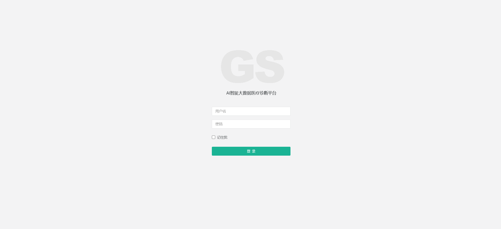

# 社区医疗

毕业设计：主题“社区医疗”

[基于Springboot、mysql]毕业设计01：主题“社区医疗”

项目完整代码已上传，包含必要代码备注

数据库私聊获取：

email：xiehdwork@163.com

wx:15349843018

项目部署+指导；论文指导；答辩细节指导......

账号密码：

1. 超级管理员：admin/admin
2. 医生：doctor/123
3. 患者：patient/123

#### 系统部分页面：

1. 系统登录页面：

2. 管理员页面

3. 医生页面：

4. 患者页面：

